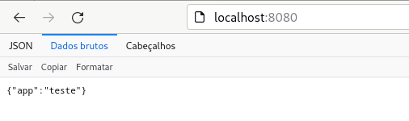
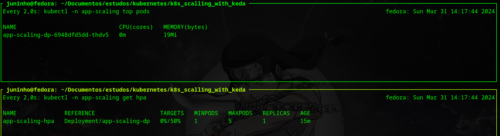
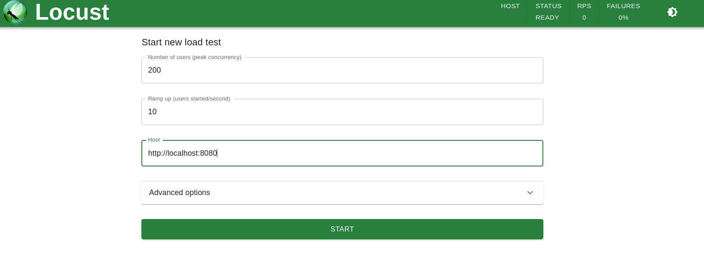
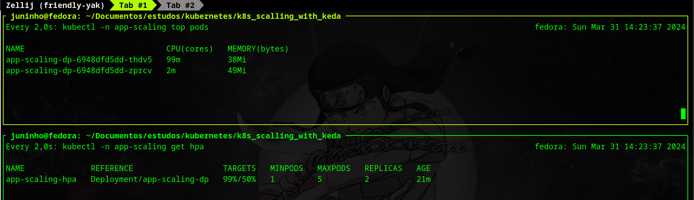

# K8s scaling with KEDA

This project is an example of how to use KEDA to scale deployments in Kubernetes, I will show you how to install, configure and give one case of how to use KEDA for scaling.

## Required:

* k8s Cluster (with metrics server installed)
* helm

## Let's deploy the example app

The first thing that we need to deploy the example-app is creating a namespace:

<pre>
kubectl create ns app-scaling
</pre>
After namespace app was created, we need to deploy the app, for this action run the command below:
<pre>
kubectl apply -f k8s/app-scaling/
</pre>
Let's test if the example-app is working with port-forwarding:
<pre>
kubectl -n app-scaling port-forward svc/app-scaling-svc 8080:8080
</pre>
    
It's working 😁:

## What is KEDA ?

KEDA is a Kubernetes-based Event Driven Autoscaler. With KEDA, you can drive the scaling of any container in Kubernetes based on the number of events needing to be processed.

You can use KEDA to 3 different functions in Kubernetes, they are:

* **Agent**: KEDA activates and deactivates Kubernetes Deployments to scale to and from zero on no events. This is one of the primary roles of the keda-operator container that runs when you install KEDA.
* **Metrics**: KEDA acts as a Kubernetes metrics server that exposes rich event data like queue length or stream lag to the Horizontal Pod Autoscaler to drive scale out.
* **Admission webhooks**: Automatically validate resource changes to prevent misconfiguration and enforce best practices by using an admission controller. 

### Install KEDA
In this case, I'm using helm to install [KEDA](https://keda.sh/), but if you want to know more about install, see the official docs.

Adding repo:
<pre>
helm repo add kedacore https://kedacore.github.io/charts
</pre>

Updating repo:
<pre>
helm repo update
</pre>

Installing:
<pre>
helm install keda kedacore/keda --namespace keda --create-namespace
</pre>

## Let's scale the example app using CPU metrics

Apply the CPU scaling manifest:
<pre>
kubectl apply -f k8s/keda/cpu/
</pre>

Now we can see the HPA was created:
<pre>
kubectl -n app-scaling get hpa
</pre>
output:

It's working 😁

## Now let's stress the app to see scale working

In this example I'm using locust to stress the app, you can see the app consuming 0% of CPU below:

Let's set 200 users to access the app:

After a few minutes we can see the scale working and 2 replicas up:

